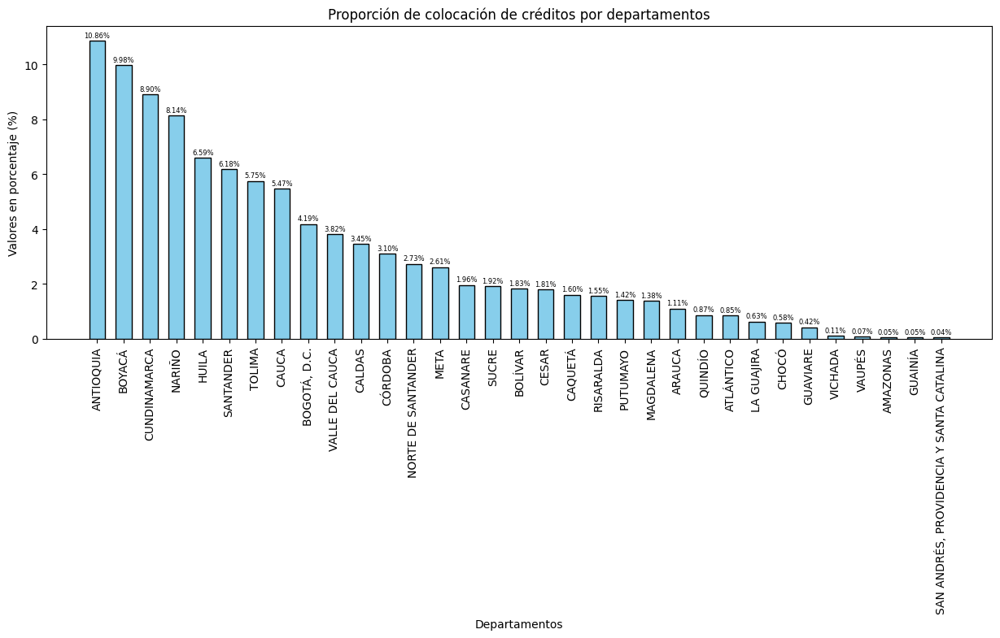
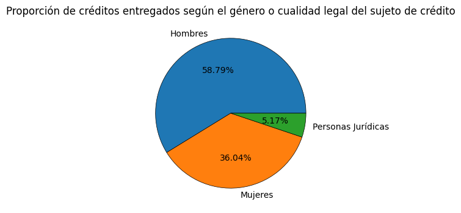
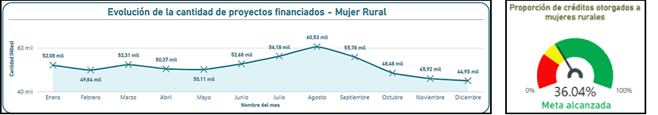
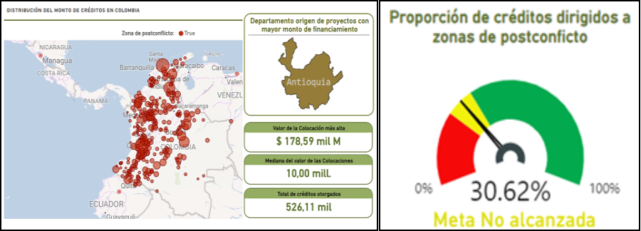

# Datos para la inclusión: Análisis de las dinámicas crediticias de FINAGRO (2021-2024) en la inclusión financiera, diversificación agropecuaria y equidad de género en zonas rurales y de posconflicto en Colombia

## Resumen

Investigación fundamentada en el proceso de análisis exploratorio de datos, y presentación visual de "insights" y KPIs de un historial de operaciones crediticias llevadas a cabo por el Fondo para el Financiamiento del Sector Agropecuario (FINAGRO) entre enero de 2021 y septiembre de 2024, en el que se busca entender el impacto de los créditos colocados sobre tres dimensiones de estudio: 1) inclusión financiera, 2) diversificación agropecuaria y 3) equidad de género. Los resultados del análisis arrojaron que FINAGRO ha diversificado la agricultura y contribuido a la modernización del sector rural con tecnologías sostenibles y cultivos no tradicionales, reduciendo la dependencia de monocultivos, aunque los créditos colocados para este destino son muy bajos. Por otro lado, la  entidad ha impulsado significativamente la autonomía económica de mujeres rurales, superando el 35% en créditos asignados a este grupo en comparación con el total de colocaciones. Además, la ejecución de planes de créditos especiales han permitido en las zonas de post-conflicto, la generación de empleo, la inversión en infraestructura y cohesión social, aunque los créditos en estas regiones han disminuido desde 2021.

## Entendimiento del enfoque investigativo

FINAGRO ha jugado un papel clave en el fomento del desarrollo agropecuario en Colombia, desempeñando un papel crucial en la canalización de recursos hacia estas poblaciones vulnerables, especialmente luego de décadas de conflicto armado que dejaron profundas huellas en el tejido social y económico de las zonas rurales. No obstante, persisten interrogantes sobre cómo las operaciones crediticias de FINAGRO han impactado factores clave de la más reciente modernidad nacional como la equidad de género, la diversificación productiva y el desarrollo de las zonas afectadas por el conflicto armado. Por esta razón, es necesario entender cómo las operaciones de crédito de la entidad se comportan en diferentes escenarios y qué factores influyen en su asignación y desempeño.

## Entendimiento de los datos

El conjunto de datos analizados, relacionados directamente con las colocaciones de créditos de FINAGRO, está comprendido por 1,814,2600 operaciones únicas y 26 características. Las características o variables incluyen información sobre los cortes mensuales de la operación, el tipo de fondeo, el tamaño del productor financiado, el valor del crédito, el valor de la valorización del proyecto, la ubicación del proyecto empresarial, la ubicación de la sucursal que hizo la colocación, el plazo de amortización, el tipo de actividad financiada, el destino del crédito, el valor de la garantía y el género del productor.
A continuación, las imágenes muestran la distribución geográfica de las colocaciones de crédito y la discriminación por la cualidad legal del sujeto (género).

**Distribución geográfica** 

    

**Distribución por género**

    

Como parte del proceso de análisis exploratorio de datos, se estandarizaron nombres de variables, se garantizó la integridad de las relaciones entre codificación interna y valores reales, se eliminaron columnas innecesarias, se verificaron valores nulos y registros duplicados y se identificaron valores atípicos.

## Resultados del análisis

Algunos de los hallazgos más significativos del estudio son:
- El valor total de las colocaciones fue dirigido en mayor medida hacia productores formalizados legalmente como empresa con personería jurídica, con una representatividad del 75,18% del valor total registrado, sin discriminar la categorización del municipio del proyecto en el postconflicto.
- Solo el 14,48 % del monto total colocado fue dirigido a financiar proyectos en zonas postconflictos, de los cuales en su gran mayoría son productores hombres y empresas formalizadas.
- El crédito dirigido a zonas de postconflicto fue utilizado principalmente para Inversión en capital de trabajo, seguido muy cercanamente por el destino a inversión en activos fijos.
- El mayor valor de los créditos está dirigido a la reproducción de bovinos y bufalinos comerciales, con una abismal diferencia, con el segundo destino más representativo, de $0.69 billones de pesos.
- En un promedio aproximado, FINAGRO financió el 75,84% del valor de los proyectos presentados por las productoras mujeres, los cuales la mitad de ellas adquirió un crédito por valor igual o inferior a $ 7.370.000 pesos.
- El financiamiento de los créditos rotativos a través de tarjetas de crédito y la inversión en servicios de apoyo de producción, conforman las líneas productivas principal con necesidad de respaldo crediticio entre las productoras mujeres, siendo la línea de tarjetas de crédito la más predominante entre ellas, con un valor promedio de crédito que cuadriplica a la segunda línea de producción más representativa.
- Los proyectos liderados por mujeres se llevaron a cabo principalmente en tres departamentos nacionales: Boyacá con un total de 78,58 mil proyectos presentados,  Nariño con un total de 66,77 mil proyectos presentados y Cundinamarca con un total de 61,55 mil proyectos presentados.
- Entre enero de 2021 y septiembre de 2024, la cobertura de FINAGRO a nivel nacional fue del 100%, lo que indica una presencia absoluta de esta institución en todo el territorio colombiano. Esto es importante al momento de analizar la gestión de créditos puesto que permite identificar que no existen barreras territoriales en los productos y servicios financieros.
- Con relación al impacto en el desarrollo sostenible de la economía y la sociedad, durante enero de 2021 y septiembre de 2024, FINAGRO financió, en promedio, el 74,97% de los requerimientos de inversión de proyectos MiPymes (Micro, pequeños y medianos productores), los cuales requirieron el 50% de las ocasiones, inversiones por un monto igual o inferior a $ 10.000.000 de pesos.
- En el área de sostenibilidad ambiental, FINAGRO no es una empresa que se destaque. Este hecho es deducible cuando se determina que el solo el 2,76% de los créditos otorgados entre enero de 2021 y septiembre de 2024 fueron con intenciones de reforestación y recuperación de tierras.

A continuación, las imágenes muestran la evolución de los créditos otorgados a mujer rural, su representatividad y las colocaciones de créditos en zonas postconficto.

**Distribución de las colocaciones de créditos a mujer rural en el tiempo** 

    

**Colocaciones de créditos en zonas postconflicto**

    

## Conclusión

FINAGRO ha desempeñado un papel fundamental en la transformación del sector rural colombiano, fomentando la diversificación agropecuaria al financiar proyectos que reducen la dependencia de monocultivos tradicionales y promueven el uso de tecnologías modernas. Además, ha logrado avances significativos en la inclusión financiera de las mujeres rurales, permitiéndoles acceder a recursos para emprender proyectos agrícolas, ganaderos y de microempresas, fortaleciendo así su autonomía económica. Por otro lado, los programas destinados a zonas de posconflicto han generado empleo, infraestructura y cohesión social, contribuyendo a la estabilización económica y la consolidación de la paz en comunidades afectadas por el conflicto armado.
Sin embargo, aún persisten retos, como la limitada cobertura en regiones de difícil acceso, la disminución de créditos destinados a zonas de posconflicto en los últimos años y la necesidad de ajustar las estrategias para maximizar el impacto según los perfiles de productores atendidos. Estos desafíos reflejan oportunidades de mejora en la oferta de financiamiento para seguir transformando el panorama rural colombiano.

Para optimizar futuras investigaciones, se recomienda ampliar el horizonte temporal de análisis para captar tendencias a largo plazo, consolidar dimensiones geográficas para facilitar el estudio del flujo de recursos, e incluir datos sobre morosidad para identificar patrones de riesgo. Asimismo, es crucial segmentar los análisis por grupos específicos como MiPymes y grandes productores, y priorizar estudios en mujeres rurales y zonas de posconflicto. Finalmente, incorporar factores contextuales como tasas de interés o políticas públicas podría enriquecer la comprensión de las dinámicas del crédito en el sector rural.
